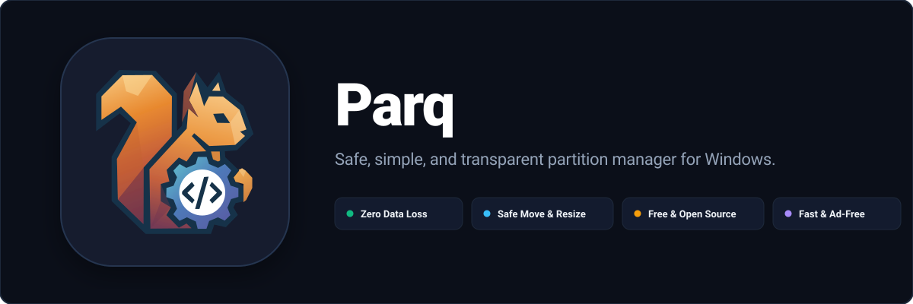

<p align="center">
  
</p>

<p align="center">
  <a href="LICENSE.MD"></a>
  
  
  
</p>

---

## 📖 Overview

**Parq** is a safe, simple, and modern disk partition manager designed for Windows.

Most existing Windows partition tools are bloated with intrusive ads, bundleware, and paywalls for basic operations. Parq was built to provide a **clean, transparent, and completely free alternative** that puts your data safety first.

---

## 🛡️ Why Parq?

### 1. Zero Accidental Data Loss
- **Safe 4-Step Verification**: Every destructive action requires plan review and confirmation before anything touches your drive.
- **System Drive Protection**: Your Windows boot drive (`C:`), EFI system partition, recovery sectors, and encrypted BitLocker volumes are automatically guarded against accidental deletion or formatting.
- **Drive Serial Confirmation**: Dangerous actions require typing the target disk's serial number to prevent misclicks on the wrong drive.

### 2. Move & Resize Partitions Safely
- **Resumable Data Moves**: Move supported offline MBR/GPT data partitions with durable checkpoints and overlap-safe copying.
- **Integrity Checks & Resume**: Every moved data block is verified with cryptographic checksums. If anything interrupts the process, Parq resumes from a durable checkpoint.
- **Windows Volume Resize**: Resize NTFS data volumes and the active Windows volume within limits reported by `Get-PartitionSupportedSize`. Active system-partition movement has a developer-only WinPE workflow and is not yet integrated into the product UI.

### 3. Clean, Fast, and 100% Free
- **No Ads or Bloatware**: No bundled toolbars, trial limitations, or background telemetry services.
- **Instant Launch**: Starts up instantly and uses minimal system memory.
- **Modern Windows 11 UI**: Clear, intuitive partition maps showing exactly how much space is used and where your files reside.

---

## 🏗️ Architecture & Documentation

For developers interested in the internal implementation, safety models, and low-level disk I/O:

- [architecture.md](docs/architecture.md) — System architecture & data flow
- [safety-model.md](docs/safety-model.md) — Safety guards & system drive protection
- [v2-charter.md](docs/v2-charter.md) — V2 Move engine charter & safety standards
- [v2-move-algorithm.md](docs/v2-move-algorithm.md) — Sector migration & checkpoint algorithm
- [winpe-offline-system-move.md](docs/winpe-offline-system-move.md) — Developer workflow for offline Windows partition moves

---

## 🚀 Getting Started

### Prerequisites

- **OS**: Windows 10 (1809+) or Windows 11
- **Node.js**: v20+ & npm
- **Rust**: 1.80+ (`rustup default stable`)
- **C++ Build Tools**: Visual Studio with "Desktop development with C++" workload

### Development

```bash
# 1. Clone repository
git clone https://github.com/mirusu400/parq.git
cd parq

# 2. Install dependencies
npm install

# 3. Run in development mode
npm run tauri dev
```

### Production Build

```bash
# Compile optimized Windows installer (.msi / .exe)
npm run tauri build
```

---

## 📄 License

This project is licensed under the [GNU General Public License v3.0 (GPL-3.0)](LICENSE.MD).
